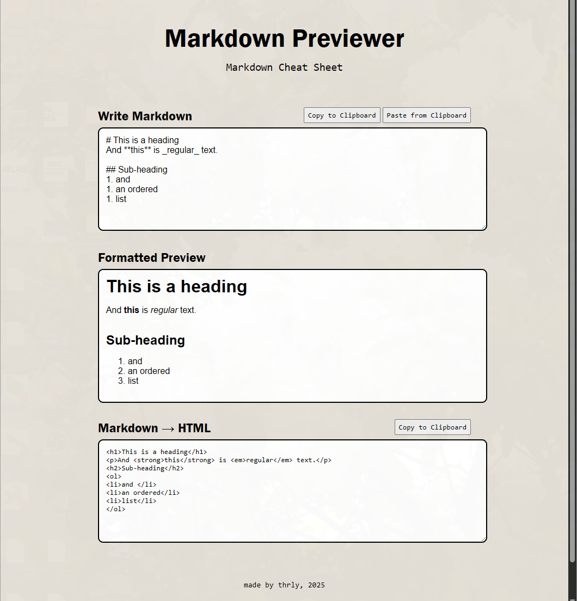

# Markdown → HTML previewer

Type in Markdown and get a live formatted preview. As a bonus, you also get HTML code and some handy clipboard buttons.

## View the demo site: <https://md-preview-47li.onrender.com/>

The Docker container is hosted by Render. (Free platform, so excuse the spin-up times).

> [!NOTE]
> I made this as a quick study to learn Docker and hosting Dockerized sites. Yes, this site could more easily (and quickly) run as a GitHub Pages site without using vite + npm etc., but its just an exercise for Docker, so I wanted some dependencies and a build in there...

## How to run with Docker

1. Clone and cd into this repo.
1. Build your Docker container: `docker build -t thrly/md-preview .`
1. Run your new container: `docker run -p 5000:8080 docker.io/thrly/md-preview`
1. The page is running at <http://localhost:5000>
